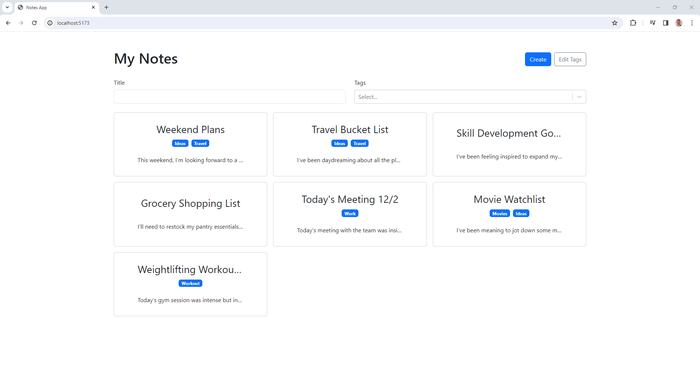

# React Notes App

This is a simple note-taking application built using React, Typescript, and Vite. It allows users to create, edit, and delete notes, with the data stored locally using the browser's local storage. The application also utilizes React Router for navigation and React Bootstrap for styling components.

## Features

- Create new notes: Easily add new notes with a title and content.
- Edit existing notes: Update the title or content of any note.
- Delete notes: Remove unwanted notes with a simple click.
- Local Storage: Your notes are stored locally in the browser, ensuring they persist across sessions.
- Responsive Design: The app is built with React Bootstrap, making it mobile-friendly and accessible on all devices.

## Technologies Used

- React: A JavaScript library for building user interfaces.
- TypeScript: A statically typed superset of JavaScript that enhances code quality and maintainability.
- Vite: A fast and lightweight development tooling for modern web projects.
- React Router: A declarative routing library for React to handle navigation within the application.
- React Bootstrap: A UI framework for React applications, providing pre-designed components for easy implementation.
